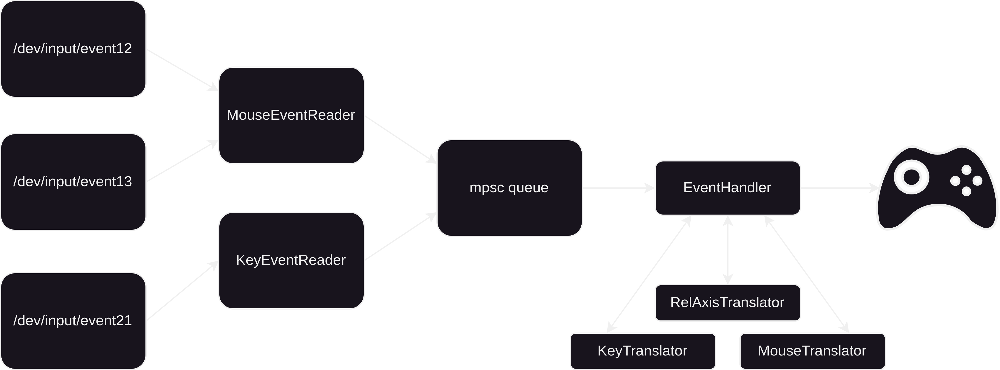

### This project is still under development.

- [ ] Read from all mouse inputs
- [ ] Config file serde default values
- [ ] Make it possible to have no keybinds
- [x] Support for key maps
- [x] Support for mouse y axis
- [ ] Handle devices connecting and disconnecting without crashing
- [ ] Update event handler, translators and readers methods to support start and stop instead of spawn and join.
- [x] Support for toml config file
- [x] Let mouse control L joystick
- [ ] Two mouse joystick modes -> either fixed or movable

#### Architecture

